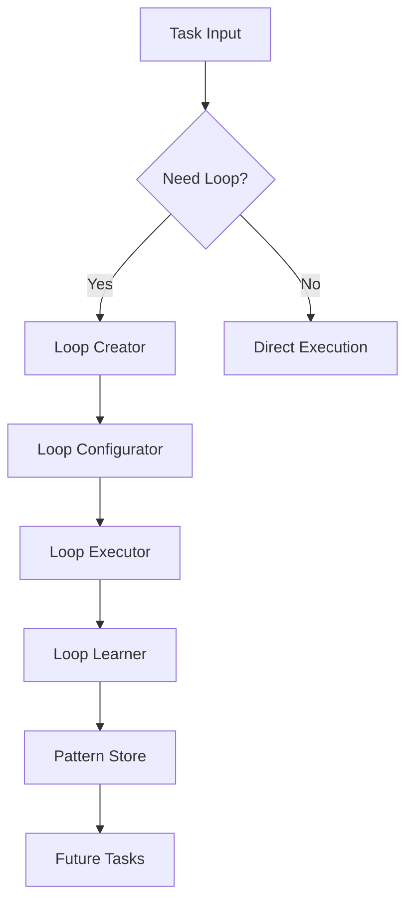

# Deep Autonomous Loop System

## Multi-Level Intelligence Matrix

| Nivel | Componentă | Funcție | Instrument |
|-------|------------|---------|------------|
| **L1** | Execution Loop | Reparare cod, debug | Debugger, Linter |
| **L2** | Structural Loop | Arhitectură, design patterns | Causal Graph, Topology |
| **L3** | Interaction Loop | UX, interfață | User Journey, Analytics |
| **L4** | Purpose Loop | Scop business, intenție | OKRs, Feedback |

## System Architecture

## Auto-Regeneration Rules

1. **Every 3 failed attempts** → Generate new loop variant
2. **Every success** → Store pattern in AgentDB
3. **Every 24h** → Review & evolve top 5 patterns
4. **Every 7d** → Prune obsolete loops

## Integration Points

- **CCDEW Core**: `ccdew_loop_*` tools
- **AgentDB**: Pattern storage & retrieval
- **SAFLA**: Adaptive learning weights
- **Enneagram Router**: Intelligent loop selection
