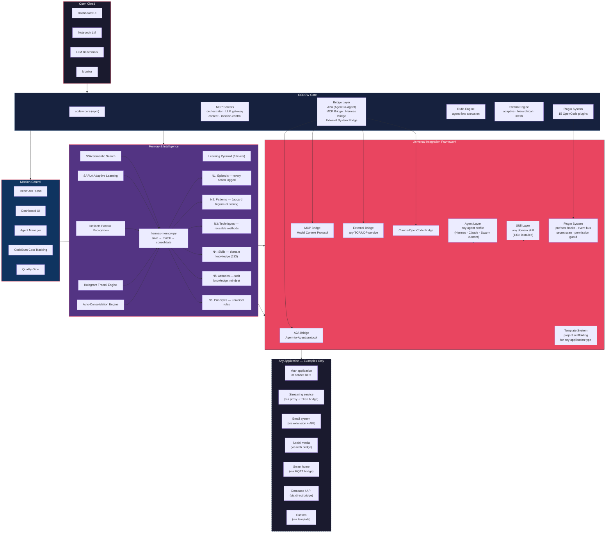

# CCDEW — Claude Code Desktop Ecosystem Workspace

**Open Cload Intelligence Suite + CCDEW Core** — Un framework universal pentru agenți AI autonomi, cu integrare pentru orice tip de aplicație, învățare continuă, memorii ierarhice și auto-evoluție.

```
  ┌──────────────────────────────────────────────────────────────────┐
  │                      OPEN CLOAD (Desktop UI)                    │
  │  dashboard · notebook · monitor · LLM benchmark                 │
  └────────────────────────┬─────────────────────────────────────────┘
                           │
  ┌────────────────────────▼─────────────────────────────────────────┐
  │                      CCDEW CORE                                  │
  │   ccdew-core (npm) · MCP servers · Bridges · Ruflo · Swarm      │
  └────────────────────────┬─────────────────────────────────────────┘
                           │
  ┌────────────────────────▼─────────────────────────────────────────┐
  │                      MISSION CONTROL                             │
  │   API server · dashboard · agent manager · metrics · health      │
  └────────────────────────┬─────────────────────────────────────────┘
                           │
  ┌────────────────────────▼─────────────────────────────────────────┐
  │            INTELLIGENCE & MEMORY (Piramida 6 nivele)            │
  │  Episodic → Patterns → Techniques → Skills → Attitudes → Princ  │
  │  SSA · SAFLA · Instincts · Hologram · Auto-Learner              │
  └────────────────────────┬─────────────────────────────────────────┘
                           │
  ┌────────────────────────▼─────────────────────────────────────────┐
  │  ANY APPLICATION — via Universal Integration Framework           │
  │  Bridges · MCP · Plugins · Agents · Skills · Templates          │
  └──────────────────────────────────────────────────────────────────┘
```

---

## Ce este CCDEW

CCDEW este un **ecosistem modular** pentru construirea și rularea de agenți AI autonomi. Nu este legat de nicio aplicație anume — oferă infrastructura prin care **orice** aplicație, serviciu sau sistem poate fi integrat și controlat de agenți.

### Principii de design

- **Universal** — poți integra orice: streaming, email, home automation, social media, baze de date, APIs, device-uri, rețele
- **Auto-evolutiv** — sistemul învață din fiecare acțiune și se optimizează singur
- **Decuplat** — fiecare componentă e independentă; nimic nu depinde de o aplicație specifică
- **Securizat** — vault criptat, secret scanning, permission guard pe 3 nivele
- **Extensibil** — adaugi aplicații prin bridges, MCP servers, plugins sau skills

---

## Arhitectura



---

## Piramida Învățării — 6 Nivele

| Nivel | Ce face | Motor |
|-------|---------|-------|
| **N1 — Episodic** | Salvează fiecare acțiune și rezultat | `episodic.jsonl` |
| **N2 — Patterns** | Grupează acțiuni similare (Jaccard trigram) | `patterns.json` |
| **N3 — Techniques** | Extrage metode reutilizabile | `techniques.json` |
| **N4 — Skills** | Construiește skill-uri specializate | `skills_db.json` |
| **N5 — Attitudes** | Modelează atitudini și mindset | `tacit.json` |
| **N6 — Principles** | Stabilește principii universale | `principles.json` |

Consolidare automată: `hermes-memory.py` + `auto_learn_consolidate.py`

---

## Cum integrezi o aplicație

CCDEW oferă mai multe căi de integrare, în funcție de ce fel de aplicație/serviciu ai:

### 1. Bridge — pentru orice serviciu extern
```python
# Un bridge poate conecta ORICE protocol:
# HTTP, WebSocket, MQTT, TCP, UDP, gRPC, serial, etc.
from claude.bridge import ExternalBridge

bridge = ExternalBridge(protocol="mqtt", host="...")
bridge.register_handler("sensors/#", on_sensor_data)
bridge.start()
```

### 2. MCP Server — pentru tool-uri expuse agenților
```javascript
// Un MCP Server expune tool-uri pe care agenții le pot apela
server.tool("search_database", { query: "string" }, async (args) => {
  return await db.query(args.query);
});
```

### 3. Plugin — pentru hook-uri în ciclul de viață
```typescript
// Plugin-urile se atașează la: pre-bash, pre-edit, post-task, session-end
export const plugin: Plugin = {
  "tool.execute.before": (ctx) => { /* permission check */ },
  "tool.execute.after":  (ctx) => { /* save episode */ },
};
```

### 4. Skill — pentru cunoștințe de domeniu
Un skill conține instrucțiuni, comenzi și workflow-uri pentru un domeniu specific. Se încarcă automat când task-ul se potrivește.

### 5. Agent Profile — pentru roluri specializate
```markdown
# Un agent profile definește un rol: analyst, coder, researcher, etc.
## Role: Database Administrator
## Tools: query, backup, optimize
## Instructions: Maintain all database systems
```

### 6. Template de proiect — pentru aplicații complete
```bash
# Creează un proiect nou din template
cp -r _TEMPLATES/generic /path/to/new-app
# Ajustează CLAUDE.md, bridges, skills
```

---

## Componente interne

### MCP Servers (4)
| Server | Rol |
|--------|-----|
| **ccdew-mcp** | Orchestrator principal — 11 tool-uri |
| **opencode-llm** | Gateway LLM (OpenRouter) |
| **notebooklm** | Content intelligence |
| **mission-control** | System snapshot & health |

### Bridges
- **A2A Bridge** — protocol Agent-to-Agent
- **MCP Bridge** — conectare servicii externe
- **External Bridge** — orice protocol TCP/UDP
- **Claude-OpenCode Bridge** — conversație bidirecțională

### Ruflo Engine
Motor de workflow pentru agenți — `ruflo.cjs`. Rulează flow-uri secvențiale sau paralele.

### Enneagram Routing
Rutare pe 9 noduri cognitive — fiecare tip Enneagram tratează task-uri după profilul său.

---

## Quick start

```bash
# Bootstrap
bash bootstrap-ccdew.sh

# Pornește Mission Control
python3 .claude/helpers/mission-control.py

# Status
curl http://localhost:8899/status.json
```

---

## Structură

```
CCDEW/
├── .claude/
│   ├── helpers/       # Motoare: memory, bridges, agents, skills
│   ├── mcp/           # MCP servers
│   ├── agents/        # Agent profiles
│   ├── bridge/        # Bridge layer
│   ├── skills/        # Domain skills
│   └── commands/      # CLI commands
├── .opencode/         # Plugin system
├── ccdew-core/        # NPM library
├── _TEMPLATES/        # Project templates (generic, android, carte, etc.)
└── [your-apps]/       # Your integrated applications here
```

---

## Securitate

- **3 nivele de sensibilitate**: PUBLIC / PRIVATE / SECRET
- Vault criptat cu PIN
- Secret scanning automat (pre-commit)
- Permission guard pe comenzi bash
- Security monitoring la 12h

---

## Licență

MIT — vezi [LICENSE](./LICENSE).

---

*CCDEW — Un framework care integrează orice. Auto-vindecare. Auto-optimizare. Auto-evoluție.*
