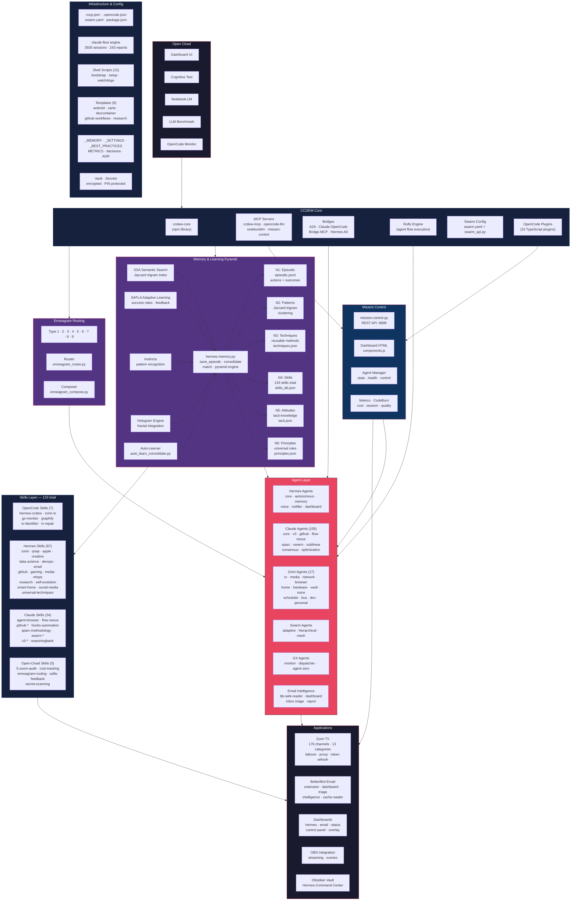

# CCDEW — Claude Code Desktop Ecosystem Workspace

**Open Cload Intelligence Suite + CCDEW Core** — Un ecosistem complet pentru agenți AI autonomi, cu învățare continuă, memorii ierarhice, rutare Enneagram și auto-evoluție.

```
  ┌──────────────────────────────────────────────────────────────────┐
  │                      OPEN CLOAD (Desktop UI)                    │
  │  dashboard · cognitive test · notebook · benchmark · monitor    │
  └────────────────────────┬─────────────────────────────────────────┘
                           │
  ┌────────────────────────▼─────────────────────────────────────────┐
  │                      CCDEW CORE                                  │
  │   ccdew-core (npm) · MCP servers · Bridges · Ruflo · Swarm      │
  └────────────────────────┬─────────────────────────────────────────┘
                           │
  ┌────────────────────────▼─────────────────────────────────────────┐
  │                      MISSION CONTROL                             │
  │   mission-control.py · dashboard API · agents · metrics          │
  └────────────────────────┬─────────────────────────────────────────┘
                           │
  ┌────────────────────────▼─────────────────────────────────────────┐
  │            INTELLIGENCE & MEMORY (Piramida 6 nivele)            │
  │  N1 Episodic → N2 Patterns → N3 Techniques → N4 Skills          │
  │  → N5 Attitudes → N6 Principles                                 │
  │  SSA semantic · SAFLA learning · Instincts · Hologram           │
  └────────────────────────┬─────────────────────────────────────────┘
                           │
  ┌────────────────────────▼─────────────────────────────────────────┐
  │  AGENTS · SKILLS · BRIDGES · APPS                               │
  │  Hermes · Claude · Zorin · Swarm · GitHub · GX · TV · Email     │
  └──────────────────────────────────────────────────────────────────┘
```

---

## Arhitectura completă



---

## Piramida Învățării — 6 Nivele

| Nivel | Ce conține | Unde |
|-------|-----------|------|
| **N1 — Episodic** | Acțiuni, comenzi, rezultate | `episodic.jsonl` |
| **N2 — Patterns** | Pattern-uri Jaccard trigram | `patterns.json` |
| **N3 — Techniques** | Metode reusable | `techniques.json` |
| **N4 — Skills** | 133 skill-uri specializate | `skills_db.json` |
| **N5 — Attitudes** | Cunoștințe tacite, mindset | `tacit.json` |
| **N6 — Principles** | 14 principii universale | `principles.json` |

Motor: `hermes-memory.py` — salvare episoade, match pattern-uri, consolidare automată.

---

## Componente cheie

### MCP Servers
| Server | Tools | Rol |
|--------|-------|-----|
| **ccdew-mcp** | 11 (route, safla, audit, cost, snapshot, compact...) | Orchestrator principal |
| **opencode-llm** | 5 (models, providers, chat, embedding, cost) | Gateway LLM (OpenRouter) |
| **notebooklm** | NotebookLM integration | Content intelligence |
| **hermes-mission-control** | Hermes MC API | System snapshot & health |

### Agenți principali
- **Hermes** — Agent central cu autonomie, voce, notificări, dashboard
- **105 Claude Agents** — Core, v3, GitHub, Flow-Nexus, SPARC, Swarm, Sublinear, Consensus, Optimization
- **17 Zorin Agents** — TV, media, rețea, browser, home, hardware, vault, voice, etc.
- **Swarm Agents** — Adaptive, hierarchical, mesh coordinators
- **GX Agents** — Monitor, dispatcher, agent-zero

### Bridges
- **A2A Bridge** — Agent-to-Agent prin MCP
- **Claude-OpenCode Bridge** — Conversație bidirectională
- **Bridge-MCP Server** — MCP bridge extern
- **Hermes A0** — Agent-Zero bridge

### Ruflo Engine
Motor de workflow pentru agenți — `ruflo.cjs`. Rulează flow-uri de agenți cu execuție secvențială/paralelă.

### Enneagram Routing
Rutare pe 9 noduri (tipurile Enneagram) — fiecare nod tratează task-uri după profilul său cognitiv. `enneagram_router.py` + `enneagram_compose.py`.

---

## Cum rulează

```bash
# Bootstrap complet
bash /home/think/CCDEW/bootstrap-ccdew.sh

# Pornește Mission Control
python3 .claude/helpers/mission-control.py

# Pornește Ruflo
node .claude/helpers/ruflo.cjs

# Status live
http://localhost:8899/status.json
http://localhost:8899/channels.json
```

---

## Structura directorului

```
CCDEW/
├── .claude/
│   ├── helpers/         # Python + CJS scripts (engine)
│   ├── mcp/             # MCP servers
│   ├── agents/          # 105 agent profiles
│   ├── bridge/          # A2A + Claude-OpenCode bridges
│   ├── skills/          # 34 Claude skill directories
│   └── commands/        # CLI commands (analysis, automation, github, etc.)
├── .opencode/           # OpenCode plugins + config
├── .claude-flow/        # Flow engine (3505 sessions)
├── agents/              # 15 top-level agent profiles
├── ccdew-core/          # NPM library (CLI binaries)
├── _MEMORY/             # Memory files (L0-L4, ADRs, identity)
├── _SETTINGS/           # Rules, configs, changelogs
├── _TEMPLATES/          # Project templates
├── _METRICS/            # Cost & optimization metrics
├── betterbird-ccdew/    # BetterBird Thunderbird extension
├── Open-Cload/          # Open Cload desktop variant
├── Hermes-Command-Center/ # Obsidian vault
├── hermes-mcp-stdio/    # MCP stdio interface
├── safla-weights/       # SAFLA adaptive weights
└── project-arch/        # Architecture plugin
```

---

## Aplicații integrate

### Zorin TV Romania
176 canale live, 13 categorii, failover automat p11→p13→p9, token refresh la 5 min, watchdog la 2 min, clean/probe la 6h.

### BetterBird Email Intelligence
Extensie Thunderbird cu dashboard, cache reader, raport brut, triaj inbox, intelligence engine.

### Dashboards
- Hermes Dashboard (`/status.json`)
- Email Dashboard (`/claude/helpers/email-dashboard-server.py`)
- CCDEW Control Panel (`ccdew-panel.html`)
- Open Cload Dashboard (`/Open-Cload/.opencode/dashboard.html`)

---

## Securitate

- Vault criptat cu PIN protected
- Secret scanning automat (pre-commit hook)
- Permission guard pe comenzi bash
- Security monitoring la 12h
- 3 nivele de sensibilitate: PUBLIC / PRIVATE / SECRET

---

## Licență

MIT — vezi [LICENSE](./LICENSE).

---

*CCDEW — Un ecosistem care crește singur. Auto-vindecare. Auto-optimizare. Auto-evoluție.*
